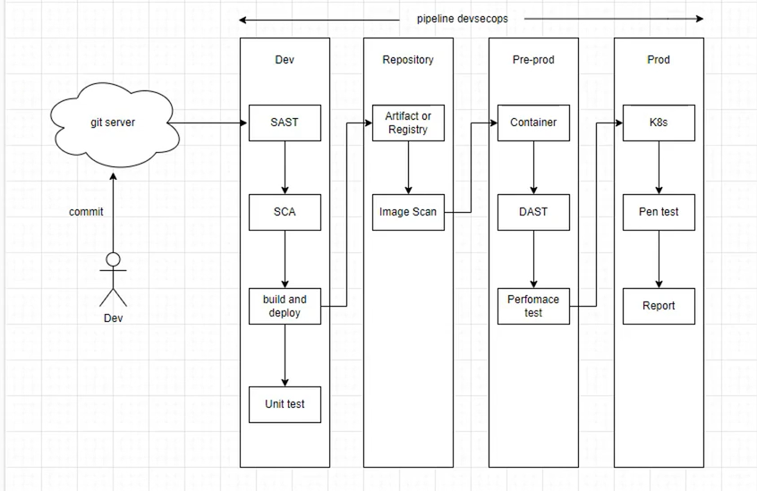
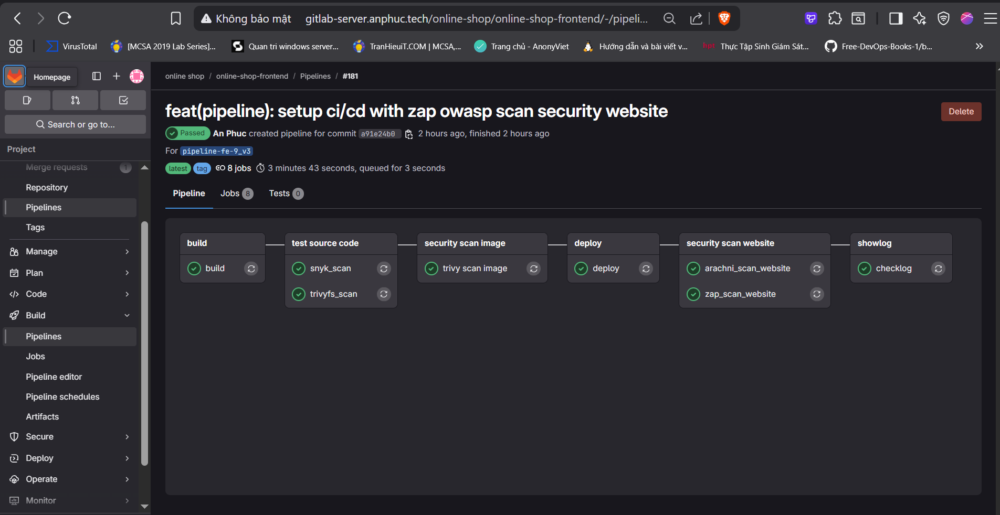
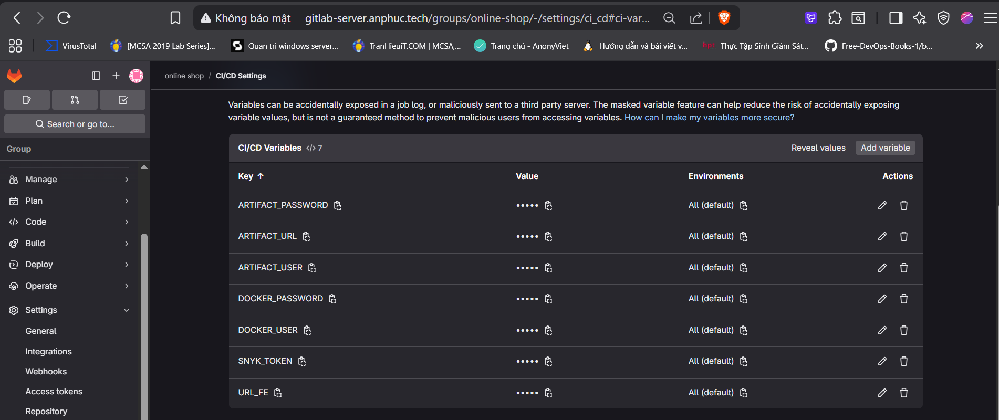
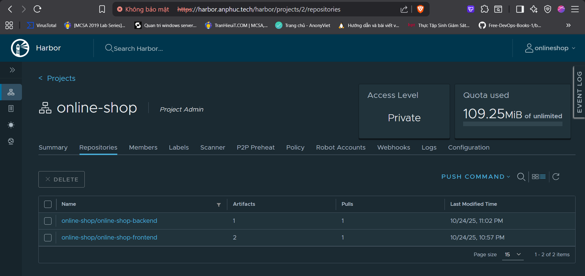
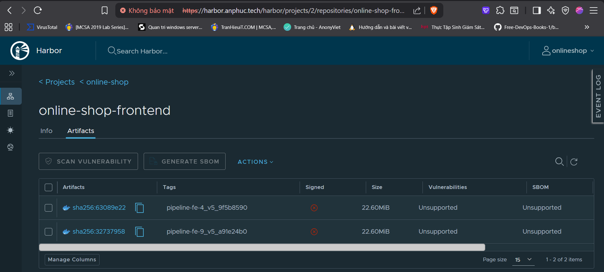
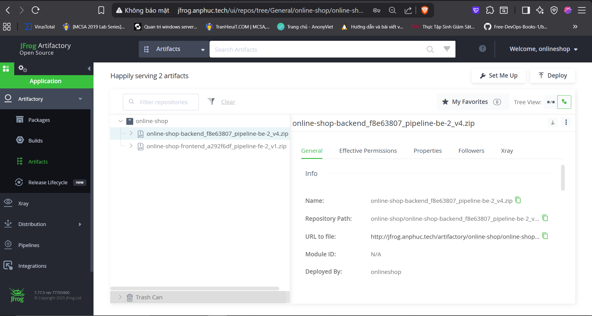
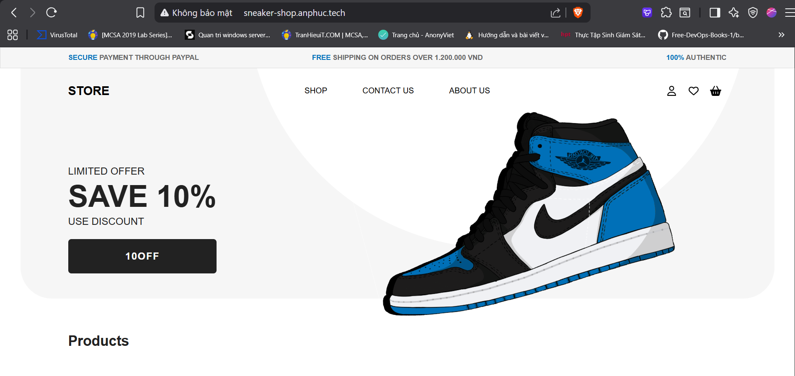
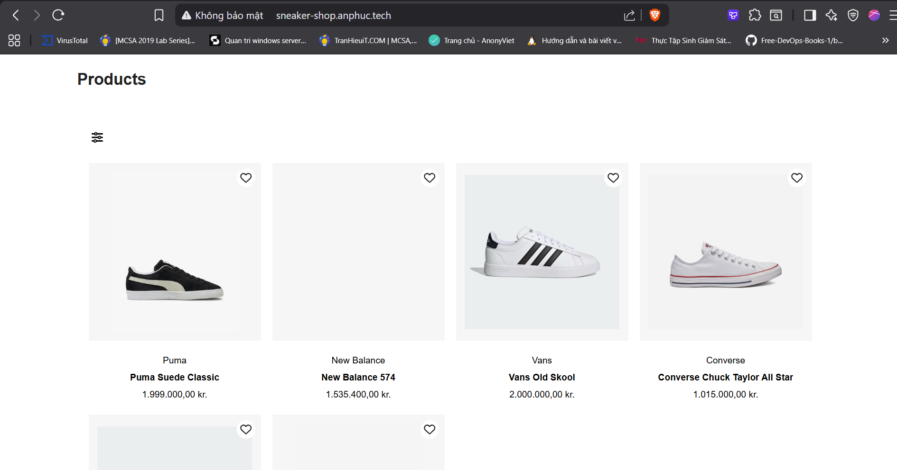

# DevSecOps Pipeline Project

## Introduction

This project simulates and implements a **complete DevSecOps workflow**, focusing on automating security testing within the CI/CD process. The entire pipeline is built on **GitLab CI/CD** and **GitHub Actions**, covering multiple security validation stages including **SAST, SCA, Image Scan**, and **DAST**.

The pipeline represents a realistic DevSecOps workflow — from source code commit to testing, packaging, vulnerability scanning, and application deployment.

## Pipeline Workflow

**DevSecOps Workflow:**

  

### Stage Descriptions:

* **Commit:** Developers push code to the Git repository.
* **SAST (Static Application Security Testing):** Analyze source code to detect potential security vulnerabilities.
* **SCA (Software Composition Analysis):** Check third-party dependencies for known vulnerabilities.
* **Build:** Compile and package the application.
* **Artifact:** Store verified and tested build packages.
* **Image Scan:** Scan Docker images for vulnerabilities.
* **Deploy:** Deploy containers to a local or cloud environment.
* **DAST (Dynamic Application Security Testing):** Perform dynamic security testing on the running application.

## Tools & Technologies

| Purpose                    | Tools / Technologies          |
| -------------------------- | ----------------------------- |
| **CI/CD**                  | GitLab CI/CD, GitHub Actions  |
| **Static Analysis (SAST)** | Snyk                          |
| **Dependency Scan (SCA)**  | Trivy, OWASP Dependency-Check |
| **Image Security**         | Aqua Trivy                    |
| **Dynamic Testing (DAST)** | OWASP ZAP, Arachni            |
| **Containerization**       | DockerHub, JFrog, Harbor              |
| **Language / Runtime**     | Node.js, .NET 6, Java, Linux  |

## System Architecture
👉 Built and deployed the project using a custom [**Dockerfile**](/Dockerfile) \
👉 Version running on **GitLab Server** using [**.gitlab-ci.yml**](.gitlab-ci.yml) \
👉 Version running on **GitHub Actions**:
**[🔗 DevSecOps GitHub Actions Pipeline](https://github.com/Bel7phegor/sneaker-ecommerce/actions/runs/18738830251)**

Push on **[DockerHub: anphuc2370](https://hub.docker.com/r/anphuc2370/online-shop-frontend)**

### Security Reports & Artifacts

All reports generated during pipeline execution are stored in **HTML** format for easy viewing or download.

* **SAST:** [Snyk Report](./artifacts/snyk_scan.zip)
* **SCA:** [Trivy Report](./artifacts/trivyfs_scan.zip)
* **Image Scan:** [Trivy Docker Image Report](./artifacts/trivy%20scan%20image.zip)
* **DAST:** [OWASP ZAP Report](./artifacts/zap_scan_website.zip) / [Arachni Report](./artifacts/arachni_scan_website.zip)

## **📸 Visual Results**

**GitLab Pipeline Workflow Result:**

  

**GitLab Variables:**

  

**Harbor Private Registry:**

  
  

**JFrog Artifacts:**

  

**Application After Deployment:**

  
  

## Achievements

* Completed a full **DevSecOps pipeline** on both **GitLab** and **GitHub Actions**.
* Automated security scans for source code, dependencies, and container images.
* Integrated **dynamic application security testing (DAST)** before deployment.
* Fully automated the CI/CD process — from build and test to deployment.
* Implemented and pushed container images to a **Harbor private registry** for secure storage and management.

## Future Development

* Integrate **K6** for performance testing.
* Expand deployment to **AWS**, leveraging services such as:

  * **ECR** for Docker image storage.
  * **ECS / EKS** for containerized application deployment.
  * **CloudWatch** for log and performance monitoring.
* Add **Secret Scanning** and **Infrastructure as Code Security (IaC Scan)**.
* Build a centralized monitoring dashboard with **Grafana + Prometheus**.

## Author

**Nguyen An Phuc**
| Fresher DevOps Engineer / Network Engineer |

Interested in building secure, automated DevSecOps pipelines and scalable cloud systems.

📧 [phucan2370@gmail.com](mailto:phucan2370@gmail.com)
🌍 [GitHub](https://github.com/Bel7phegor) | 👉 [LinkedIn](https://www.linkedin.com/in/nguyen-an-phuc/)
